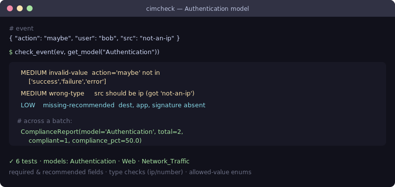

# cimcheck — Splunk CIM compliance checker

[](https://github.com/JCreatesGH/cim-check/actions)
[](https://www.python.org/)
[](LICENSE)

Validate that your events map cleanly to the Splunk **Common Information Model**. If a source isn't CIM-compliant, your data-model-driven dashboards and correlation searches silently return nothing — `cimcheck` catches that before it ships, and now tells you **how to fix it**: when a required field is missing under its CIM name but present under a common alias (`username` → `user`, `src_ip` → `src`), cimcheck detects it and generates the Splunk `FIELDALIAS` props.conf stanza to remediate.



## Install

```bash
pip install cimcheck
```

## Use it

```python
from cimcheck import get_model, check_event, check_events, suggest_fieldaliases, render_props_conf

model = get_model("Authentication")    # Web, Network_Traffic, Change also built in

for f in check_event(event, model):
    print(f.severity, f.rule, f.field, f.message)

report = check_events(events, model)
report.compliance_pct                  # 87.5
report.findings_by_rule                # {"field-aliased": 3, "wrong-type": 1, ...}

# Detect the source fields that should be aliased to CIM names, then emit props.conf
aliases = suggest_fieldaliases(events, model)        # {"user": "username", "src": "src_ip"}
print(render_props_conf("my:sourcetype", aliases))   # FIELDALIAS-cim_user = username AS user
```

## CLI

Installing the package adds a `cimcheck` command — feed it events as JSON (a list, or a Splunk
`{result:[...]}` export):

```bash
$ cimcheck Authentication events.json                  # compliance summary (+ FIELDALIAS hints)
$ cimcheck Web events.json --findings --json           # per-event findings, machine-readable
$ cimcheck Network_Traffic events.json --min-compliance 95   # exit 1 below 95% (CI gate)
$ cimcheck Authentication events.json --fieldalias my:sourcetype   # emit props.conf to fix it
$ cimcheck --list-models
```

The summary flags fields you can fix without re-ingesting data, and `--fieldalias` prints the
stanza to paste into `props.conf`:

```ini
[my:sourcetype]
FIELDALIAS-cim_src = src_ip AS src
FIELDALIAS-cim_user = username AS user
```

## Checks

- **`missing-required`** (high) — a required CIM field is absent or empty *and no known alias is present*; these break data-model acceleration.
- **`field-aliased`** (high / low) — the CIM field is missing under its canonical name, but a common alternate name (`username`, `src_ip`, `response_code`, …) holds the value. The finding carries the exact `FIELDALIAS` line to fix it. Severity matches the field's tier (high for required, low for recommended).
- **`wrong-type`** (medium) — typed fields validated as `number` / `ip` (e.g. `status` must be numeric, `src`/`dest` must be IPs).
- **`invalid-value`** (medium) — enum fields checked against allowed sets (`action ∈ {success, failure, error}`, `http_method ∈ {GET, POST, …}`).
- **`missing-recommended`** (low) — recommended fields that improve correlation, with no alias present.

An event is counted "compliant" if it has no high-severity findings. Each built-in model ships an `aliases` map of the most common real-world field names per CIM field; `suggest_fieldaliases(events, model)` votes across the whole dataset to pick the most likely source for each. Define your own `DataModel` (with its own `aliases`) to extend beyond the four built in (Authentication, Web, Network_Traffic, Change).

## Development

```bash
pip install -e .[dev] && python -m pytest -q   # 21 tests
```

## License

MIT
